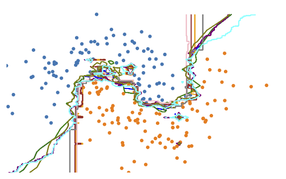

# DIG in Machine Learning models
##### Understanding Prediction Discrepancies in Machine Learning Classifiers

This repository contains the code for DIG (Discrepancy Interval Generation). DIG is a tool to detect and understand the prediction discrepancies in models with similar predictive performances on a dataset.

<div style="text-align:center">
<figure>

<figcaption>An example of explanation generated by DIG to understand prediction discrepancies around a point of the dataset.</figcaption>
</figure>
</div>

## About prediction discrepancies and DIG, the algorithm to explain them

We showed on an OpenML benchmark suite that virtually all datasets suffer from prediction discrepancies.
What are prediction discrepancies? Why do they exist? What are the consequences? How to address this issue?
We provide below some elements to answer those questions. All the details, with descriptions and evaluations of both prediction discrepancies and the DIG algorithm, are available in the article https://arxiv.org/abs/2104.05467.

### Prediction discrepancies

A multitude of classifiers can be trained on the same data to achieve similar performances during test time while having learned significantly different classification patterns.

<div style="text-align:center">
<figure>

<figcaption>10 classifiers with similar performances on Half-Moons dataset.</figcaption>
</figure>
</div>

When selecting a classifier, the machine learning practitioner has no understanding on the differences between models, their limits, where they agree and where they don’t. But this choice will result in concrete consequences  for  instances  to  be  classified  in  the discrepancy zone,  since the final decision will be based on the selected classification  pattern. Besides the arbitrary nature of the result, a bad choice could have further negative consequences such as loss of opportunity or lack of fairness.

### Capture and explain prediction discrepancies

DIG is a a model-agnostic algorithm proposed to capture and explain prediction discrepancies in a pool of best-performing models trained on the same data locally, to enable the practitioner to make the best educated decision when selecting a model by anticipatingits potential undesired consequences.

<div style="text-align:center">
<figure>

<figcaption>The main steps of the DIG algorithm to discover prediction discrepancies.</figcaption>
</figure>
</div>

## Getting started with DIG

### Prerequisites

The following dependencies are required:
* numpy
* scipy
* pandas
* sklearn
* xgboost
* autogluon, autosklearn or tpot
* networkx
* matplotlib
* seaborn

### Installation

To install mltasks:

1. Clone the repo
```sh
git clone https://github.com/axa-rev-research/discrepancies-in-machine-learning.git
```

2. Install the package using ```pip```
```sh
pip install discrepancies-in-machine-learning
```

## Usage

```python
from discrepancies import datasets, pool, DIG

# Get data
X_train, X_test, y_train, y_test, scaler, feature_names, target_names, cat_names = datasets.get_dataset(dataset='german', test_size=0.3)
continuous_variables = list(set(feature_names) - set(cat_names))

# Fit a pool of classifiers on it (to simulate prediction discrepancies)
pool1 = pool.BasicPool(models=["SVMrbf", "RF200", "LR", "XGB", "GB"]).fit(X_train.values, y_train)

# Fit DIG to the pool of classifier to capture prediction discrepancies
digger = DIG.Digger(X_train, y_train, pool1, k_init=10, categorical_names=cat_names)
digger.fit(max_epochs=5)

# Explain a prediction discrepancy

```

An example of how to run DIG can be found in the "notebooks" folder.

Please use the "main" branch, as other branches contain work still under developpment or abandoned work.

In case of questions, do not hesitate to raise a Github issue.
